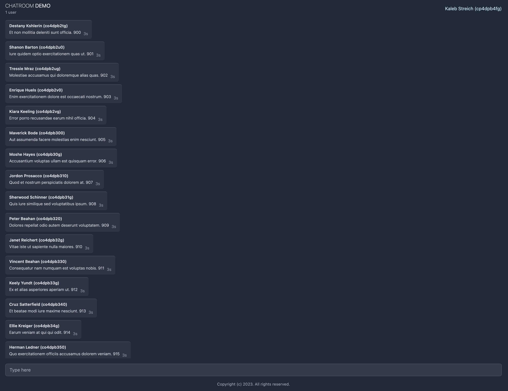

# chat-demo

Enn demonstrasion chat websocket ki servi HTMX, Templ, AlpineJS ek Go.



## Fonksionalite

- Kominikasion an tem reel par websocket
- Limitasion pou anpes abuse
- Otantifikasion itilizater avek JWT
- Design responsive 
- Filtraz bann mo vilain

## Teknologi Itilize

- **Backend**: Go
- **Frontend**:
  - [HTMX](https://htmx.org/) - Extensionn HTML pou konteni dinamik
  - [Templ](https://github.com/a-h/templ) - Template HTML avek sekirite tip pou Go
  - [AlpineJS](https://alpinejs.dev/) - Framework JavaScript lezer

## Seki ou bizin avan

- Go 1.23+
- Docker (opsionel)

## Instalasion

### Developman Lokal

1. Clone repository-la:
```bash
git clone https://github.com/mgjules/chat-demo.git
cd chat-demo
```

2. Kree enn fichie `.env`:
```bash
HTTP_PORT=8080
JWT_SECRET=to_kle_sekre
```

3. Roul aplikasion-la:
```bash
go run .
```

4. Ale lor http://localhost:8080

### Docker

1. Konstrwir ek roul container Docker:
```bash
docker build -t chat-demo .
docker run -p 8080:8080 -e JWT_SECRET=to_kle_sekre chat-demo
```

2. Ale lor http://localhost:8080

## Koman Servi

1. Ale lor http://localhost:8080
2. Ou pou otomatikman koneekte avek enn itilizater au azar
3. Kumans koze avek lezot itilizater an tem reel

## Lisans

Sa proze-la ena lisans Apache License 2.0 - get fichie [LICENSE](LICENSE) pou plis detay.